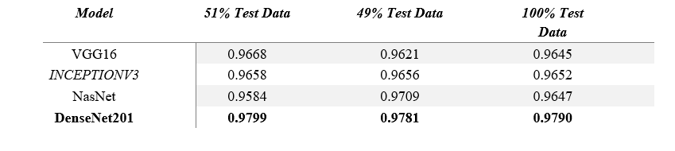
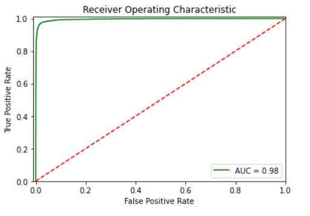
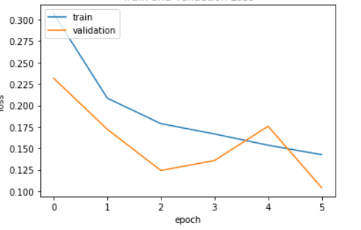

# Cancer Detection of Lymph Node Metastases (DenseNet201 Model)

## Introduction
The aim of the project is to build a Deep Learning Binary Classifier to help detect cancer tissues in histopathological scans of lymph node sections. In this work, we present our deep convolutional neural network based model validated on [PatchCamelyon(PCam)](https://github.com/basveeling/pcam)  benchmark dataset for fundamental machine learning research in histopathology diagnosis. We find that our proposed model trained with a semi-supervised learning approach by using pseudo labels on PCam-level significantly leads to better performances to strong CNN baseline on the AUC metric. Here we train the dataset on various convolution neural network models like InceptionV3, DenseNet and NasNet models. Our best model has an auc score of 97.90%. Through this project we are trying to automate the process of detecting metastatic cancer tissues in histopathologic scans of lymph node sections. The model has demonstrated that it is possible to use these type of models and apply it in pathologies for quick and accurate results.

## Architecture

  

## Results

  

  

  

## Contributors
   1. [Astitva Shrestha](https://www.linkedin.com/in/astitva17a87/)
   2. [Navdeep Singh Hada](https://www.linkedin.com/in/navdeep-singh-hada-a102b7190/)
   